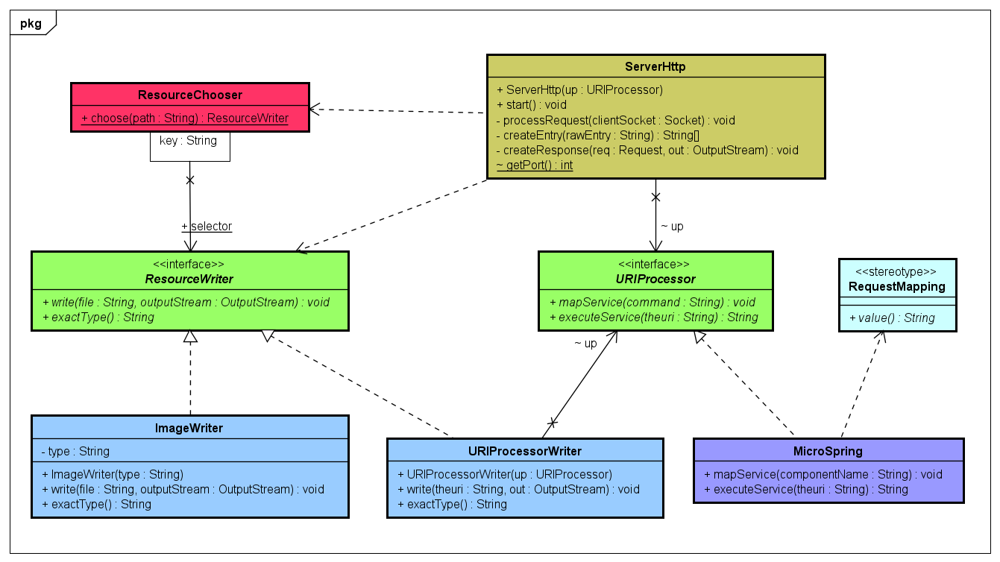

# Taller de Arquitecturas de Servidores de Aplicaciones, Meta protocolos de objetos, Patrón IoC, Reflexión.

Este programa es un servidor web que permite acceder a recursos web como html, css, js, imagenes (jpg,png) y mapear respuestas con un controlador por anotaciones.

## Autor

* **J. Eduardo Arias Barrera** - [AriasAEnima](https://github.com/AriasAEnima)

Para correr:

```
> java -cp target/classes edu.escuelaing.arep.reflexion.microspring.MicroSpringBoot edu.escuelaing.arep.reflexion.microspring.HelloController
```

## Diseño (Simplificado)




## Pruebas de Recursos:

```
> localhost:35000/index.html
```

Esta pagina cargara html, js e imagenes (recursos que están en la carpeta examples).


## Pruebas de bean (POJO):

```
> localhost:35000/Apps/hello
> localhost:35000/Apps/pi
```


## Nota:

Actualmente tiene código que se dispondrá para el Taller Clientes y Servicios.

## Licencia

This project is licensed under the MIT License  - see the [LICENSE](LICENSE) file for details
